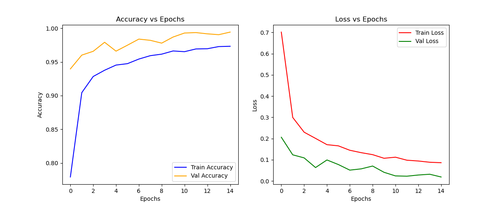

<div align="center">

```
╔══════════════════════════════════════════════════════════════════════╗
║                                                                      ║
║   ██████╗ ██╗  ██╗ ██████╗ ███████╗████████╗                         ║
║  ██╔════╝ ██║  ██║██╔═══██╗██╔════╝╚══██╔══╝                         ║
║  ██║  ███╗███████║██║   ██║███████╗   ██║                            ║
║  ██║   ██║██╔══██║██║   ██║╚════██║   ██║                            ║
║  ╚██████╔╝██║  ██║╚██████╔╝███████║   ██║                            ║
║   ╚═════╝ ╚═╝  ╚═╝ ╚═════╝ ╚══════╝   ╚═╝                            ║
║                                                                      ║
║  ██████╗ ██╗ ██████╗ ██╗████████╗                                    ║
║  ██╔══██╗██║██╔════╝ ██║╚══██╔══╝                                    ║
║  ██║  ██║██║██║  ███╗██║   ██║                                       ║
║  ██║  ██║██║██║   ██║██║   ██║                                       ║
║  ██████╔╝██║╚██████╔╝██║   ██║                                       ║
║  ╚═════╝ ╚═╝ ╚═════╝ ╚═╝   ╚═╝                                       ║
║                                                                      ║
║              Deep-Scan Handwritten Digit Recognition                 ║
║         Custom Data · MNIST Merged · Consumer CPU · Real-time        ║
╚══════════════════════════════════════════════════════════════════════╝
```

<br/>

[](/)
[](/)
[](/)
[](/)
[](/)

<br/>

> *"A deep convolutional digit recogniser trained on merged real-world and MNIST data —
> 99.13% validation accuracy, Otsu-threshold preprocessing, runs on CPU."*

<br/>

**[What is Ghost Digit](#what-is-ghost-digit) · [Architecture](#architecture) · [Results](#results) · [Dataset](#dataset) · [Preprocessing](#preprocessing) · [How to Run](#how-to-run)**

</div>

---

## What is Ghost Digit?

Ghost Digit is a **single-image handwritten digit recognition system** designed to work on real-world photographs — not just clean benchmark data.

Given an image of a handwritten digit, Ghost Digit:

1. **Preprocesses the input** — contrast enhancement, Otsu thresholding, and contour isolation
2. **Normalises the signal** — inverts, resizes to 28×28, and scales to 0.0–1.0
3. **Classifies the digit** — two-block Deep-Scan CNN with batch normalisation and dropout
4. **Returns the prediction** — digit class 0–9 with softmax confidence

The entire inference pipeline runs on **CPU**. No GPU required.

### Why Does This Matter?

MNIST models trained on clean benchmark data fail on real photographs — uneven lighting, paper texture, ink bleed, and background noise all degrade accuracy. Ghost Digit closes this gap by training on a merged dataset of custom photographed digits and 70,000 MNIST samples, then applying Otsu thresholding at inference to strip real-world noise before the model ever sees the image.

---

## Architecture

Ghost Digit is a **three-stage sequential pipeline**. Raw image in — digit class out.

```
┌──────────────────────────────────────────────────────────────────────┐
│                      GHOST DIGIT PIPELINE                            │
│                                                                      │
│   Raw Image (.jpg / .png)                                            │
│       │                                                              │
│       ▼                                                              │
│  ┌──────────────────────────────┐                                    │
│  │  STAGE 1 · Preprocessor      │  Input normalisation               │
│  │  OpenCV · CPU                │──► Contrast Enhancement            │
│  └──────────────────────────────┘──► Otsu Threshold + Contour crop   │
│       │                             → 28 × 28 px · white on black    │
│       ▼                                                              │
│  ┌──────────────────────────────┐                                    │
│  │  STAGE 2 · Deep-Scan CNN     │  Digit classification              │
│  │  ~500k params · CPU          │──► Softmax confidence [10 classes] │
│  └──────────────────────────────┘──► argmax → predicted digit        │
│       │                                                              │
│       ▼                                                              │
│  ┌──────────────────────────────┐                                    │
│  │  STAGE 3 · Output            │  Result                            │
│  │  CPU · instant               │──► Predicted digit (0–9)           │
│  └──────────────────────────────┘──► Confidence score                │
└──────────────────────────────────────────────────────────────────────┘
```

### The Deep-Scan CNN

```
Input: 28 × 28 × 1  (greyscale, white digit on black)
│
├── Block 1 — Edge Detection
│     Conv2D(32, 3×3, relu, padding=same)
│     BatchNormalization
│     Conv2D(32, 3×3, relu, padding=same)
│     BatchNormalization
│     MaxPool(2×2) → Dropout(0.2)
│
├── Block 2 — Pattern Recognition
│     Conv2D(64, 3×3, relu, padding=same)
│     BatchNormalization
│     Conv2D(64, 3×3, relu, padding=same)
│     BatchNormalization
│     MaxPool(2×2) → Dropout(0.3)
│
└── Classifier Head
      Flatten
      Dense(256, relu) → BatchNormalization → Dropout(0.4)
      Dense(10, softmax)
│
Output: probability vector [0–9]  →  argmax = predicted digit
```

### Key Design Choices

| Choice | Rejected | Chosen | Why |
|---|---|---|---|
| Conv per block | Single conv then pool | **Double conv before pool** | Two passes capture richer features before resolution halves |
| Normalisation | None | **BatchNorm after every Conv** | Stabilises training, allows higher lr, reduces covariate shift |
| Regularisation | L2 weight decay | **Dropout 0.2 → 0.3 → 0.4** | Progressively stronger — deeper layers need more regularisation |
| Preprocessing | Raw pixel input | **Otsu threshold** | Strips lighting variation, paper texture, ink bleed before inference |
| Data strategy | MNIST only | **Custom + MNIST merged** | Pure MNIST fails on real handwriting; merged dataset closes the gap |
| Output | Single logit | **Softmax over 10 classes** | Calibrated probability distribution — confidence signal is meaningful |

### Training Configuration

| Parameter | Value |
|---|---|
| Loss | Categorical cross-entropy |
| Optimizer | Adam · lr = 0.0001 |
| Batch size | 32 |
| Epochs | 15 |
| Val split | 15% of merged dataset |
| Checkpoint | Best `val_accuracy` saved automatically |
| Precision | FP32 |

### Data Augmentation

```python
ImageDataGenerator(
    rotation_range=10,        # digits written at slight angles
    zoom_range=0.10,          # size variation across writers
    width_shift_range=0.10,   # horizontal position variation
    height_shift_range=0.10   # vertical position variation
)
```

---

## Results

| Metric | Value |
|---|---|
| **Validation Accuracy** | **99.13%** |
| **Validation Loss** | **0.0269** |
| Training Accuracy | ~97.5% |
| Training Epochs | 15 |
| Total Training Images | ~91,500 |
| Model File Size | ~5 MB (`.h5`) |

### Training Curves



Val accuracy leads train accuracy throughout — a healthy sign that augmentation is forcing the model to generalise rather than memorise. Both loss curves converge cleanly with no late-stage divergence.

### What the Model Sees

```
  RAW INPUT                    AFTER PREPROCESSING
  ─────────                    ───────────────────
  Uneven background       →    Clean black field
  Low contrast digit      →    High contrast white digit
  Paper grain / noise     →    Noise stripped by Otsu threshold
  Arbitrary brightness    →    Normalised 0.0–1.0
  Any input size          →    28 × 28 px  (MNIST-standard)
```

**Before preprocessing** – noisy background, low contrast, MNIST pipeline would fail:


**After contrast enhancement + Otsu threshold** – clean digit, ready for the CNN:


---

## Dataset

| Source | Images | Role |
|---|---|---|
| **Custom (photographed)** | ~1,500 | Real-world handwriting, 10 digit classes, folders `0/`–`9/` |
| **MNIST (train + test)** | 70,000 | Standard benchmark — full dataset merged for maximum coverage |
| **Total** | **~91,500** | Merged, synchronised shuffle, 85/15 train/val split |

3D-FUTURE for Ghost Eye is to furniture what this merged dataset is to digits — domain-relevant training data matters more than raw volume.

### Data Processing Pipeline

```
Custom .jpg images
      │
      ├─► 1. Load as greyscale
      ├─► 2. Invert  (black ink on white → white digit on black, matching MNIST)
      ├─► 3. Resize  (any resolution → 28 × 28 px)
      └─► 4. Normalise  (0–255 → 0.0–1.0 float32)

MNIST images
      │
      └─► Reshape + Normalise  (same pipeline)

Both sources
      │
      ├─► Concatenate X and y arrays
      ├─► Synchronised shuffle  (critical — keeps labels matched to images)
      ├─► One-hot encode labels  (9 → [0,0,0,0,0,0,0,0,0,1])
      └─► train_test_split  (85% train / 15% val, random_state=42)
```

---

## Preprocessing

At inference, real photographs need an additional preparation step before the CNN sees them. The model was trained on MNIST-style white-digit-on-black images — raw photos don't match that format.

```
Real photograph
      │
      ├─► 1. Greyscale conversion
      ├─► 2. CLAHE contrast enhancement    (compensates for uneven lighting)
      ├─► 3. Otsu thresholding             (auto-binarise: digit white, background black)
      ├─► 4. Contour detection             (isolate the digit, crop tight)
      ├─► 5. Resize to 28 × 28 px
      └─► 6. Normalise 0.0–1.0  →  model-ready input
```

> **Why Otsu?** Otsu's method automatically finds the optimal threshold to separate foreground (digit) from background — no manual tuning needed across different lighting conditions.

---

## Technical Risk Register

| Risk | Severity | Detail | Mitigation |
|---|---|---|---|
| **Real-world lighting** | 🔴 HIGH | Raw photos have uneven illumination — model trained on normalised data | CLAHE contrast enhancement before Otsu threshold |
| **Background noise** | 🔴 HIGH | Paper grain, shadows, texture degrade pixel values | Otsu binarisation strips background entirely |
| **Digit scale variation** | 🟡 MEDIUM | Writers vary digit size; off-centre or partial digits confuse classifiers | Contour crop + resize normalises scale at inference |
| **Absolute file paths** | 🟡 MEDIUM | Scripts hardcode `D:\...` paths — breaks on any other machine | Update `BASE_DIR` and `save_path` before running |
| **Augmentation gap** | 🟢 LOW | Training aug (rotation, zoom, shift) may not cover all real handwriting variation | Extended aug in `DEEP_CNN.PY` adds brightness range |

---

## How to Run

### Requirements

```bash
pip install tensorflow opencv-python numpy scikit-learn
```

### Repository Structure

```
ghost-digit/
│
├── README.md
│
├── batch_preprocessing.py           Loads and preprocesses custom digit images
├── deep_cnn_mnist_dataset.py        Training script (used for saved model)
├── DEEP_CNN.PY                      Alternate — stronger augmentation, checkpoint callback
│
├── archive (17)/                    Custom digit dataset
│   ├── 0/   *.jpg
│   ├── 1/   *.jpg
│   └── ...  9/
│
└── deep_scan_model_val-99_13__los-0_0269_with_mnist_at_32_batch_size.h5
                                     Trained model weights
```

> **Which script produced the saved model?** `deep_cnn_mnist_dataset.py` — the training curves show 15 epochs, matching that script's `epochs=15`. `DEEP_CNN.PY` runs 13 epochs and uses stronger augmentation; try it to push past 99.13%.

### Train from scratch

```bash
# Step 1 — preprocess custom images
python batch_preprocessing.py

# Step 2 — merge with MNIST and train
python deep_cnn_mnist_dataset.py
```

Update `BASE_DIR` in `batch_preprocessing.py` and `save_path` in the training script to your local paths before running.

### Load the trained model

```python
import tensorflow as tf
import numpy as np

model = tf.keras.models.load_model(
    'deep_scan_model_val-99_13__los-0_0269_with_mnist_at_32_batch_size.h5'
)

# img must be shape (1, 28, 28, 1), normalised 0.0–1.0
# white digit on black background (MNIST-style)
prediction = np.argmax(model.predict(img))
print(f"Predicted digit: {prediction}")
```

---

## Dependencies

```python
# Deep learning
tensorflow >= 2.0.0

# Image processing
opencv-python     # preprocessing, Otsu thresholding, contour detection

# Data handling
numpy
scikit-learn      # train_test_split
h5py              # .h5 model save/load
```

---

## Roadmap

```
Phase 1 — Digit Recognition (Complete)                         [ DONE ✅ ]
──────────────────────────────────────────────────────────────────────────
  ✅  Custom dataset collected and labelled  (~1,500 images, 10 classes)
  ✅  Batch preprocessing pipeline built
  ✅  MNIST merge + synchronised shuffle
  ✅  Deep-Scan CNN architecture designed
  ✅  Training run complete  (~91,500 images, 15 epochs)
  ✅  Val accuracy: 99.13%  ·  Val loss: 0.0269
  ✅  Otsu inference preprocessing implemented

Phase 2 — Real-World Robustness                                [ PLANNED ]
──────────────────────────────────────────────────────────────────────────
  ⬜  Collect more custom data — diverse handwriting styles
  ⬜  Extended augmentation  (brightness, elastic distortion)
  ⬜  Multi-digit detection  (segment and classify full number strings)
  ⬜  Lighter model variant for edge deployment

Phase 3 — Integration                                          [ PLANNED ]
──────────────────────────────────────────────────────────────────────────
  ⬜  REST API wrapper for inference
  ⬜  Live webcam inference demo
  ⬜  INT8 quantisation for mobile deployment
```

---

<div align="center">

**Ghost Digit** is part of the Ghost Eye research project.

Deep-Scan CNN · Trained on T4 · 99.13% validation accuracy.

*A Ghost Eye sibling — same philosophy, different domain.*

</div>
